# Data Lovers

# RICK AND MORTY LAND

## Índice

* [1. Descripción general](#1-descripción-general)
* [2. Perfil de usuarios](#2-perfil-de-usuarios)
* [3. Historias de Usuarios](#3-historias-de-usuarios)
* [4. Prototipo y diseño](#4-prototipo-y-diseño)
* [5. Interfaz](#5-interfaz)
* [6. Modo de usuarios](#6-modo-usuarios)
* [7. Tecnología](#7-tecnología)
* [8. Enlace web](#8-enlace-web)

***

## 1. Descripción general
Rick and Morty Land es una página web cuyo contenido trata sobre una de las animaciones para adultos más famosas y entretenida con su característico humor negro que fascina a muchos; donde  un científico alcohólico, secuestra a su influenciable nieto, Morty, para vivir peligrosas aventuras a través de diversos cosmos y universos paralelos. El contenido de la página se centra en satisfacer las curiosidades más llamativas de esta grandiosa comedia animada, brindando información relevante de todos los personajes de la serie, curiosidades intrigantes e información actualizada de noticias de último momento. 

## 2. Perfil de usuarios
El contenido de Rick and Morty Land se encuentra dirigido a usuarios en edad adulta, desde los usuarios ya conocedores y fanáticos de esta comedia para que tengan al alcance información detallada de sus personajes favoritos, asi como las noticias con respecto a Rick and Morty de forma actualizada. También va dirigido a esos usuarios principiantes u ocasionales que les llama la atención y quieran saber información breve para entrar en contexto y asi decidir ver dicha animación. Entre los perfiles, destacan 3 tipos de usuarios:

 - Usuario principiante: conoce superficialmente la serie, por recomendación o por descubrimiento propio, con interés de seguir obteniendo información.
 - Usuario fiel: conoce y consume la serie continuamente, le interesa el contenido y lo relacionado con todo lo que tenga que ver con la animación, la recomienda porque está satisfecho y a la espera de las actualizaciones.
 - Usuario curioso: conoce la serie, la ve regularmente, le gusta obtener información detallada, exacta pero a profundidad de todo.

## 3. Historias de usuarios

- Historia de usuario 1

Yo: Principiante.

Quiero: "Saber información de interés general breve y detallada de la serie".

Para: "Conocer de que se trata y decidir si la continuo viendo o no".

Criterios de aceptación:

-El usuario puede explorar la página a través de un menu desplegable, que tendrá especificado las diferentes sub-páginas de interes del usuario, por el cuál podrá desplazarse fácilmente.

-El usuario podrá encontrar un slider automático, con imágenes de momentos relevantes de la serie.

-El usuario al acceder a la página principal encontrará información detallada que dará a conocer una breve reseña de la serie.

-El usuario puede informarse de las curiosidades mas relevantes y particulares de la serie animada(sub-página _Facts_).

-El usuario podra acceder a las redes sociales de la página.

Definición de terminado:
* [X] Definir prototipo.
* [X] Definir y plasmar diseño interactivo.
* [X] Determinar contenido de sub-páginas(Home, Characters(Cards-Charts), Facts).
* [X] Menú interactivo, desplegable, de acceso a contenido detallado y de interés (header).
* [X] Slider automático con imágenes que representen momentos relevantes de la serie.
* [X] Redes sociales y marca de creación, copyright (footer).
* [X] Background de cada sub-página.
* [X] Determinar y plasmar diseño y contenido de contenedores de sub-páginas: página principal(Home) y curiosidades(Facts).

- Historia de usuario 2

Yo: Fanático(Usuario fiel).

Quiero: "Encontrar información relevante de mis personajes favoritos y los anuncios nuevos de la serie, como noticias".

Para: "Saber más sobre la serie y estar al día".

Criterios de aceptación:

-El usuario puede informarse sobre los ultimos acontecimientos de la serie animada en la seccion de noticias, situada en la página principal(_Home_).

-El usuario en cada noticia tendra acceso para ampliar la información.

-El usuario puede acceder a sus personajes favoritos en la seccion de personajes(_Characters-Cards_), con informacion detallada y de interes de cada uno, en formato de cartas.

-El usuario puede ordenar a los personajes, por: orden alfabetico(_A-Z_), por orden inverso del alfabeto(_Z-A_), por el menos popular(_Less Popular_).

-El usuario puede filtrar a los personajes, por: Género(_Gender_), Especie(_Species_) y Estatus(_Status_).

-El usuario para volver a filtrar debe limpiar los campos de selección, a través del boton limpiar(_Clear_).

-El usuario al explorar las cartas de los personajes puede volver al inicio de la página por un boton que le regresara al comienzo(_scroll to top_).

-El usuario al seleccionar opciones que no concuerda con ninguna propiedad de algun personaje, no mostrandose ningun resultado coincidente, se le notificara por un texto informativo invitandolo a que intente otra busqueda a través del filtro.


Definición de terminado:
* [X] Crear sección de noticias en página principal.
* [X] Obtener la data de Rick and Morty.
* [X] Aplicar método map-Determinar las propiedades del objeto a trabajar y desestructurar.
* [X] Crear las cartas de los personajes a través de la creación de nodos por la manipulación dinámica del DOM.
* [X] Aplicar método filter y sort.
* [X] Hacer menú filtrar y ordenar.
* [X] Asignar eventos al menú de filtrar y ordenar.
* [X] Crear boton para limpiar los cambios de selección.
* [X] Crear boton de desplazamiento hacia el inicio de la página(_scroll to top_).


- Historia de usuario 3

Yo: Curioso.

Quiero: "Conseguir información de la serie".

Para: "Analizar, comparar e informarme a profundidad de la serie".

Criterios de aceptación

-El usuario puede filtrar por multiseleccion de propiedades, para así ver cuales personajes poseen ciertas propiedades especificas.

-El usuario al filtrar podrá ver de forma interactiva la representación porcentual de los personajes en base a las propiedades seleccionadas del filtrado.

-El usuario puede tener acceso a estadísticas globales de los personajes en base a las propiedades del filtro(_Characters-Charts_).

Definición de terminado:
* [X] Filtrado multiselección.
* [X] Representación porcentual de los filtros.
* [X] Crear sub-página charts.
* [X] Determinar calculos estadísticos(computeStats).
* [X] Crear graficos.

## 4. Prototipo y diseño
### Prototipo inicial

Se realizo un prototipo inicial en papel para plasmar la distribución de los elementos de toda la página. El diseño del prototipo se baso en lo recopilado en las historias de usuarios, inspiradas en la temática de la animación. 

La página esta integrada por un menú principal desplegable para acceder a las sub-páginas correspondientes, este se encuentra en la parte superior de la misma, que constituye el header.

La página principal(_Home_) en la parte superior esta constituida por un pequeño resumen de la serie, acompañado de una sección de noticias y lanzamientos.

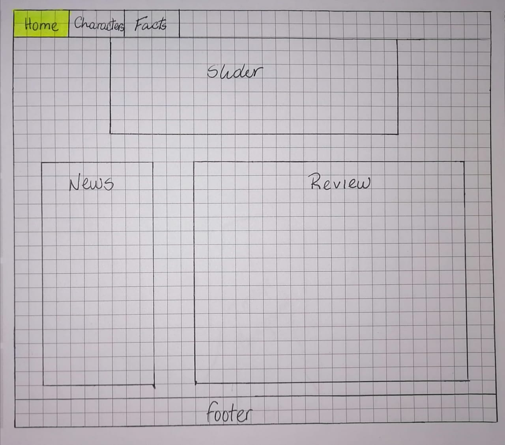

A través del boton _Characters_ se accede a la página _Cards_ y a _Charts_.
En la sub-página _Cards_ los usuarios tendran a disposición la visualización de todos los personajes de la serie en formato de cartas. También esta constituido por un menú para ordenar(_Sort by_) y filtrar(_Filter_) a los personajes, acompañado de un boton para limpiar los campor de seccion, que se encuenttra a la derecha de la seleccion de filtrado.
Debajo de los filtros, se reflaría el porcentaje que representa a los personajes que poseen las propiedades que el usurio haya seleccionado. Para facilitar la exploración del usuario se le añadio un boton para retonar hacia el comienzo de la página, el cual está ubicado en la parte inferior en el lado derecho.

 

Y a través de la sub-página _Charts_ se muestra los gráficos globales que representa a cada propiedad del filtrado.

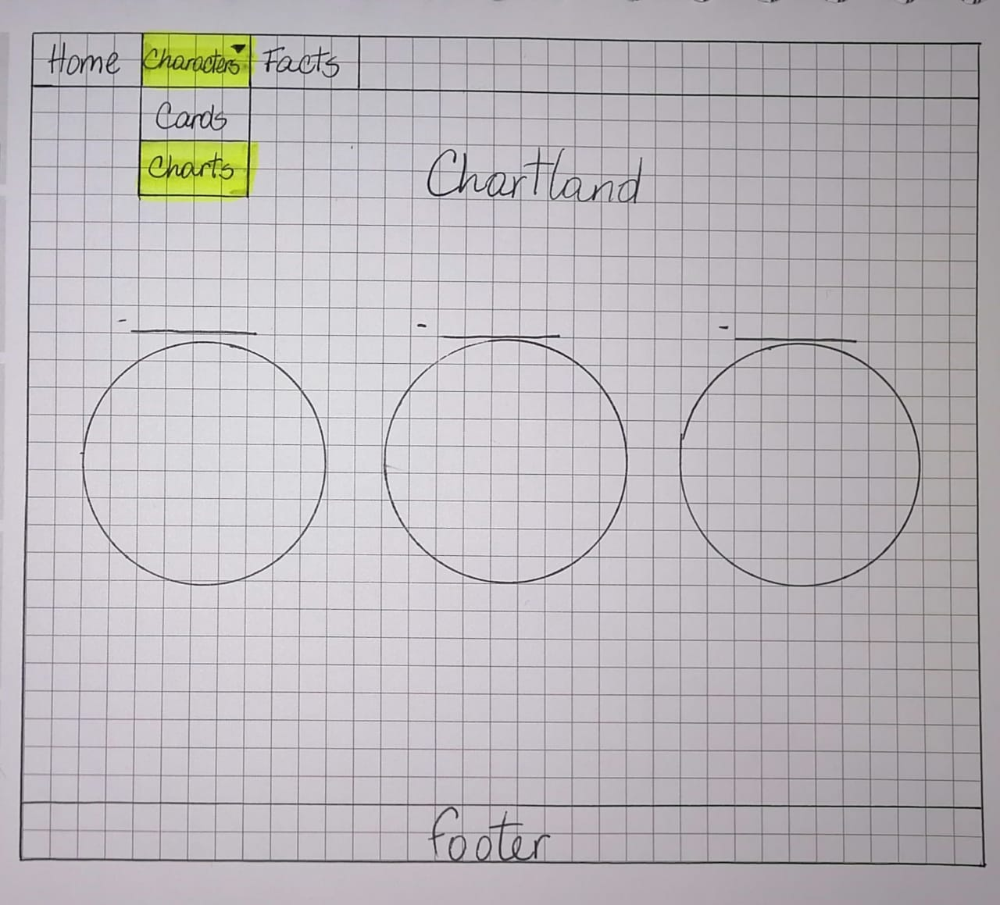 

La sub-página _Facts_ se da conocer varias curiosidades intrigantes y particulares que caracterizan a esta animación cómica, para que el usuario encuentre documentación más alla de lo que se observa en la serie. Dicha información va acompañada de una imagen representativa del dato curioso.


Una vez definido el prototipo inicial, se define la paleta de colores y se diseña un prototipo de alta fidelidad en Figma.

### -Diseño final

* Paleta de colores.

Basados en el sketh e historias, se utiliza una paleta de colores de acuerdo a la temática del usuario.

El color principal es el negro ⚫️: Refleja el universo y lo desconocido que es, al mismo tiempo la profundidad y el conocimiento. En la aunsencia del color permite resaltar la información y crear un contraste con la realidad. Los fondos son de este color, alusivo al vacio del espacio.

Color secundario es el verde 🟢: como representación y asociación a los alienígenas por este color pero tambien la tierra,  así que es la perfecta combinación que le hace alusión a esta serie. Este color predomina en el menú y en los botones que te permiten acceder a otras sub-páginas, haciendo alusion al portal verde de Rick and Morty.

Colores complementarios:

Amarillo🟡: que refleja poder e iluminacion, además que resalta el elemento que lo posee. Este color esta presente en los subtítulos y botones con funciones específicas(boton de limpiar los campos de seleccion y scroll to top).

Rosado 💗: Tipo neón para resaltar a los cuadros de textos. Sombra de los cuadros de textos.

Blanco🤍: En la tipografía para que esta resalte y neutralice en contraste con el fondo negro.

Esta paleta de colores inspirada en esta animación entre cosmos y multiversos, en donde resulta una paleta de colores en sincronia.


* Animación 

Siguiendo la temática de viajes a otras dimensiones y multiversos, se quiere reflejar con el diseño esa ilusión de estar en el espacio, se puede observar que las sombras de los cuadros de texto asemejan  como si estos flotaran.

Una secuencia en cada pagina que permite al usuario sentir afinidad y curiosidad por el contenido.

Página principal - Home
 

Sub-Página de Characteres
 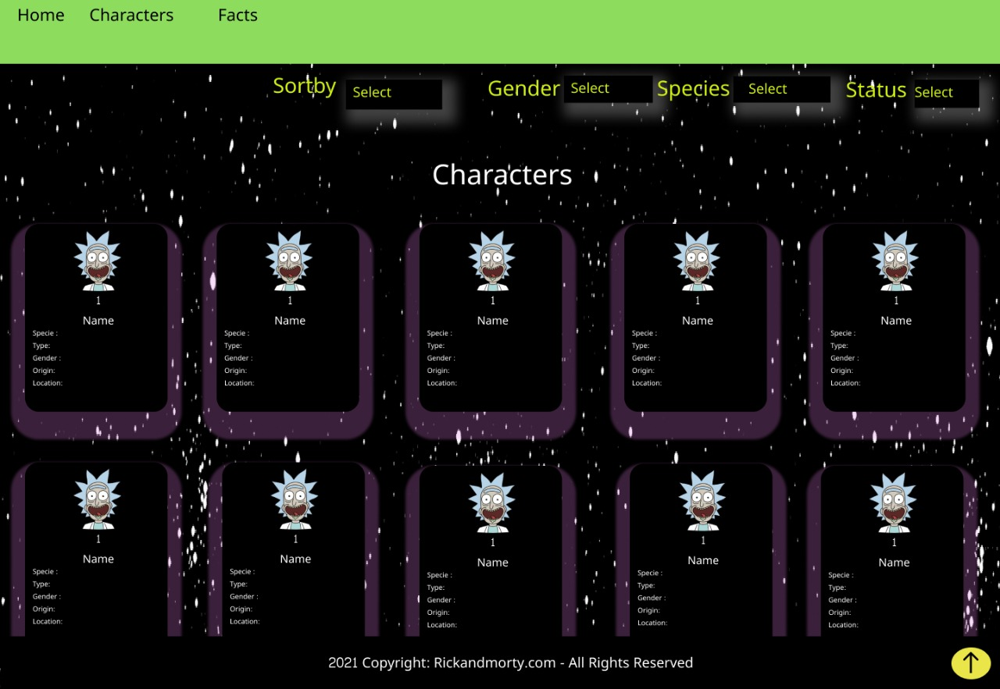
 Las cartas de los personajes sobresalen cuando el cursor del mouse se posiciona encima de la misma, para una mejor visualizacion e interacción.

 Sub-Página Estadísticas
 

 Sub-Página Ricktastick
 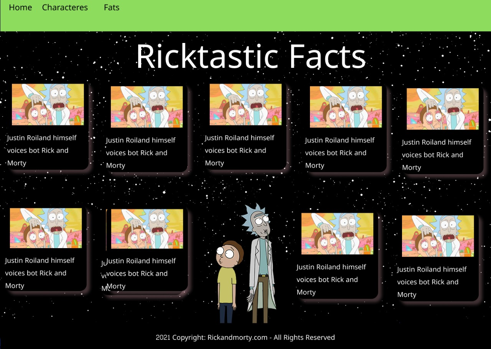


Visualizacion de prototipo en desktop en Figma
[Link](https://www.figma.com/proto/jQpY3xVMseb1vcHocvU1MC/Prototipo-Rick-and-Morty?node-id=10%3A4&scaling=min-zoom&page-id=0%3A1).


### Diseño para Smartphone 

Visualización de prototipo en smartphone en Figma
[Link](https://www.figma.com/proto/jQpY3xVMseb1vcHocvU1MC/Prototipo-Rick-and-Morty?node-id=18%3A824&scaling=min-zoom&page-id=1%3A2)

## 5. Interfaz

### Desktop
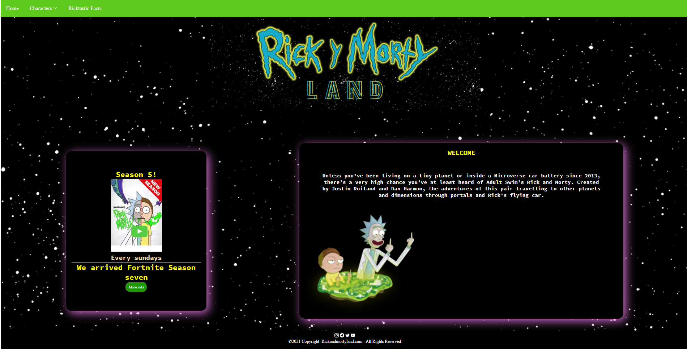


### Tablet
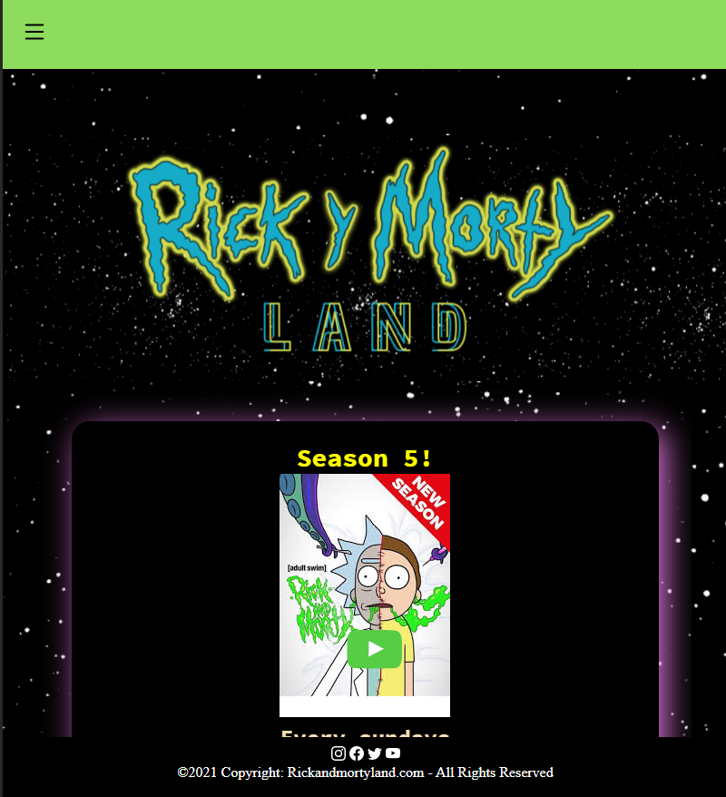
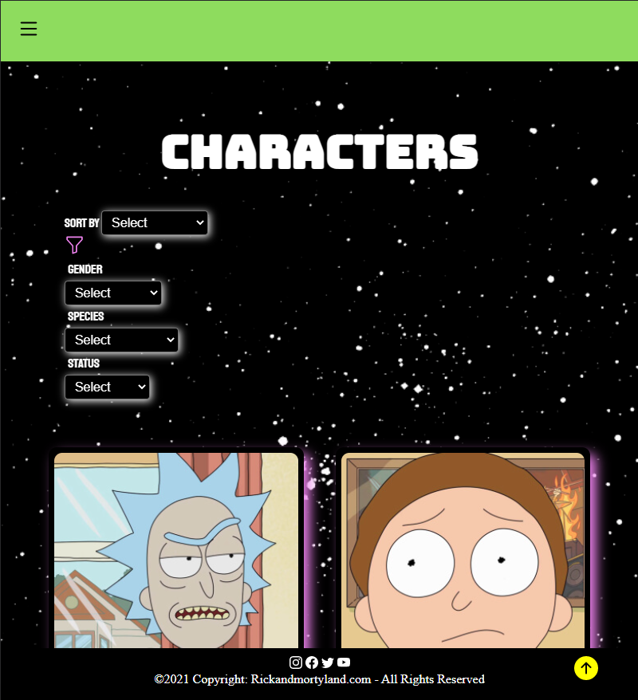
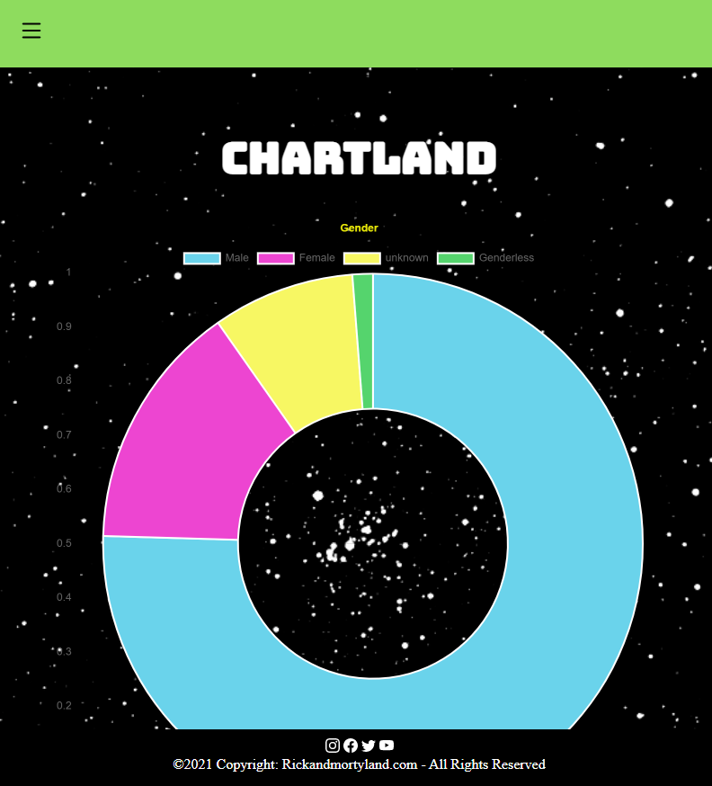
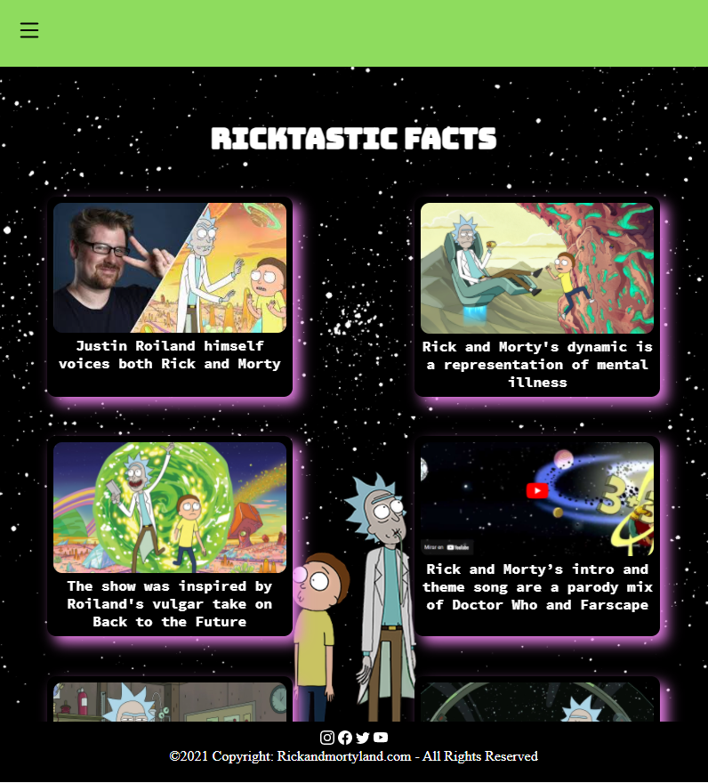

### Smartphone
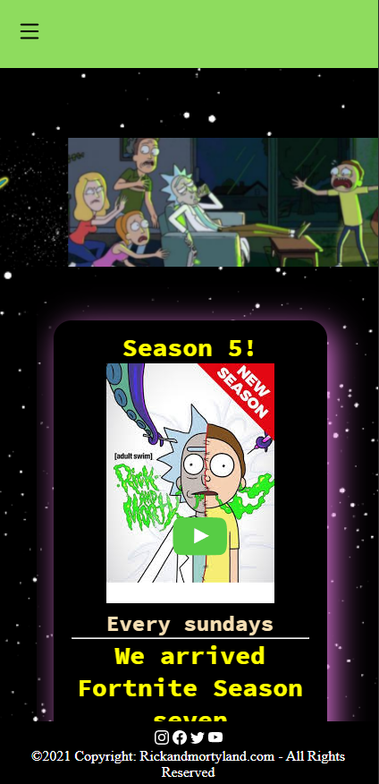
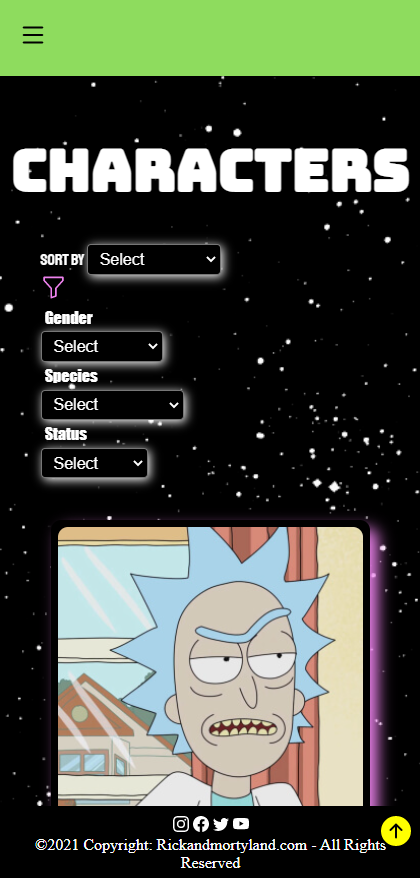

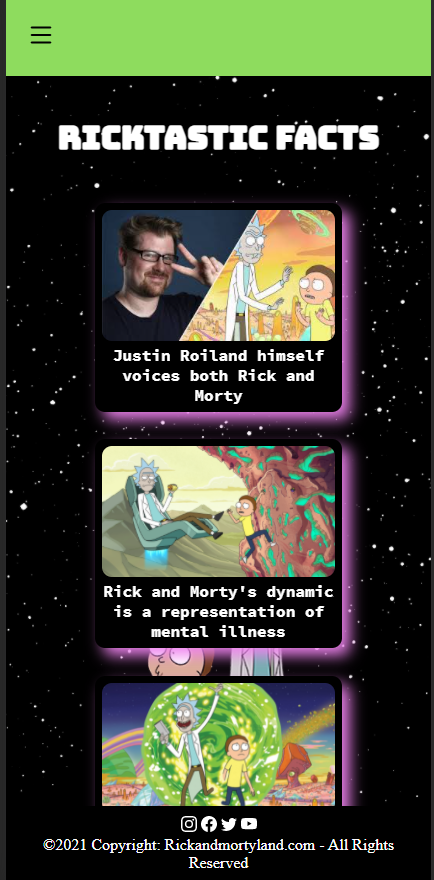

## 6. Modo de usuarios
La página web Rick and Morty Land consta de 3 sub-páginas, denominadas: _Home_(página de inicio), _Characters_(Personajes) y _Facts_(Curiosidades).

Una vez que se tiene acceso a la página se encuentra a disposición, en la parte superior, un menú desplegable, el cual consta de botones claramente identificados para el fácil acceso a las sub-páginas previamente específicadas; _Home_, _Characters_ y _Facts_, respectivamente.

Inmediatamente que se accede a la página el usuario tendra a disposición contenido informativo y de interés de esta fabulosa comedia animada, que consta de una breve reseña de la seria y un apartado de noticias de último avance de la animación, dicho contenido constituye la página de inicio; de la cual se tiene acceso a través del boton _Home_.

A través del boton _Characters_, el usuario tendra para elegir en un submenu desplegable dos opciones: 
- Boton _Cards_: En este apartado el usuario podra tener acceso a todos los personajes de la serie. Para ello, tendra un menú con opciones de:
    Ordenar por: _All_, _A-Z_(alfabeticamente), _Z-A_(alfabeto inverso), _Less Popular_(menos popular).
    Filtrar, en base a tres características de interés de los personajes:
     * Gender: _Genderless_, _Female_, _Male_, _Unknown_.
     * Species: _Alien_, _Animal_, _Cronenberg_, _Disease_, _Human_, _Humanoid_, _Mytholog_, _Parasite_, _Poopybutthole_, _Robot_, _Unknown_, _Vampire_.
     * Status: _Alive_, _Dead_, _Unknown_.
   Cada vez que el usuario seleccione una de las opciones, aparecera su representación porcentual en base al total de los personajes, siendo estos 493. Ésta se encuentra por debajo y a la derecha del filtrado.
   Una vez que el usuario haya elegido las opciones de orden y filtrado de acuerdo a su interes, se le mostrara las cartas(_Cards_) de los personajes que coinciden con las características pre-seleccionadas.
   Al desplazarse hacia abajo explorando y viendo los personajes correspondientes, el usuario tendra a su disposición en la parte inferior y a la derecha de la página un boton para desplazar hacia arriba (_Scroll to top_), determinado por una flecha en dirección hacia arriba, la cual al hacer click sobre la misma, se desplazara al inicio de la página.
   Si el usuario desea volver a filtrar, debe reiniciar los select para poder volver a elegir otras opciones, a través del boton de Limpiar, que se encuentra inmediatamente al lado derecho de la sección de filtrado en el menú.

- Boton _Charts_: En este apartado el usuario podra acceder a graficos del cálculo estadístico global de los personajes, basado en las tres propiedades de filtrado, siendo estos Gender, Species y Status, respectivamente.

A través del  boton _Facts_, el usuario podra acceder a un número de curiosidades inesperadas de la serie.

## 7. Tecnología
El proyecto es creado con:
 * HTML5
 * CSS
 * Javascript
 * NodeJS
 * Chart.js

## 8. Enlace web
  


***
<details>

# Data Lovers

## Índice

* [1. Preámbulo](#1-preámbulo)
* [2. Resumen del proyecto](#2-resumen-del-proyecto)
* [3. Objetivos de aprendizaje](#3-objetivos-de-aprendizaje)
* [4. Consideraciones generales](#4-consideraciones-generales)
* [5. Criterios de aceptación mínimos del proyecto](#5-criterios-de-aceptación-mínimos-del-proyecto)
* [6. Hacker edition](#6-hacker-edition)
* [7. Consideraciones técnicas](#7-consideraciones-técnicas)
* [8. Pistas, tips y lecturas complementarias](#8-pistas-tips-y-lecturas-complementarias)
* [9. Checklist](#9-checklist)

***

## 1. Preámbulo

Según [Forbes](https://www.forbes.com/sites/bernardmarr/2018/05/21/how-much-data-do-we-create-every-day-the-mind-blowing-stats-everyone-should-read),
el 90% de la data que existe hoy ha sido creada durante los últimos dos años.
Cada día generamos 2.5 millones de terabytes de datos, una cifra sin
precedentes.

No obstante, los datos por sí mismos son de poca utilidad. Para que esas
grandes cantidades de datos se conviertan en **información** fácil de leer para
los usuarios, necesitamos entender y procesar estos datos. Una manera simple de
hacerlo es creando _interfaces_ y _visualizaciones_.

En la siguiente imagen, podrás ver cómo con la data que que se ve en la parte
izquierda se puede construir una interfaz amigable y entendible por el usuario
al lado derecho.


## 2. Resumen del proyecto

En este proyecto **construirás una _página web_ para visualizar un
_conjunto (set) de datos_** que se adecúe a lo que descubras que tu usuario
necesita.

Como entregable final tendrás una página web que permita **visualizar la data,
filtrarla, ordenarla y hacer algún cálculo agregado**. Con cálculo agregado
nos referimos a distintos cálculos que puedes hacer con la data para mostrar
información aún más relevante para los usuarios (promedio, el valor máximo
o mínimo, etc).

Esta vez te proponemos una serie de datos de diferentes _temáticas_ para que
explores y decidas con qué temática te interesa trabajar. Hemos elegido
específicamente estos sets de datos porque creemos que se adecúan bien a esta
etapa de tu aprendizaje.

Una vez que definas tu área de interés, buscar entender quién es tu usuario
y qué necesita saber o ver exactamente; luego podrás construir la interfaz que
le ayude a interactuar y entender mejor esos datos.

Estos son datos que te proponemos:

* [Pokémon](src/data/pokemon/pokemon.json):
  En este set encontrarás una lista con los 251 Pokémon de la región de Kanto
  y Johto, junto con sus respectivas estadísticas usadas en el juego
  [Pokémon GO](http://pokemongolive.com).
  - [Investigación con jugadores de Pokémon Go](src/data/pokemon/README.md)

* [League of Legends - Challenger leaderboard](src/data/lol/lol.json):
  Este set de datos muestra la lista de campeones en una liga del
  juego League of Legends (LoL).
  - [Investigación con jugadores de LoL](src/data/lol/README.md)

* [Rick and Morty](src/data/rickandmorty/rickandmorty.json).
  Este set nos proporciona la lista de los personajes de la serie Rick and
  Morty. [API Rick and Morty](https://rickandmortyapi.com).
  - [Investigación con seguidores de Rick and Morty](src/data/rickandmorty/README.md)

* [Juegos Olímpicos de Río de Janeiro](src/data/athletes/athletes.json).
  Este set nos proporciona la lista de los atletas que ganaron medallas en las
  olímpiadas de Río de Janeiro.
  - [Investigación con interesados en juegos olímpicos de Río de Janeiro](/src/data/athletes/README.md)

## 3. Objetivos de aprendizaje

El objetivo principal de este proyecto es que aprendas a diseñar y construir una
interfaz web donde se pueda visualizar y manipular data, entendiendo lo que el
usuario necesita.

### HTML y CSS

* [ ] [Uso de HTML semántico.](https://developer.mozilla.org/en-US/docs/Glossary/Semantics#Semantics_in_HTML)
* [ ] Uso de selectores de CSS.
* [ ] Construir tu aplicación respetando el diseño realizado (maquetación).
* [ ] [Uso de flexbox en CSS.](https://css-tricks.com/snippets/css/a-guide-to-flexbox/)

### DOM y Web APIs

* [ ] Uso de selectores del DOM.
* [ ] Manejo de eventos del DOM.
* [ ] [Manipulación dinámica del DOM.](https://developer.mozilla.org/es/docs/Referencia_DOM_de_Gecko/Introducci%C3%B3n)
(appendChild |createElement | createTextNode| innerHTML | textContent | etc.)

### JavaScript

* [ ] Uso de condicionales (if-else | switch | operador ternario)
* [ ] Uso de bucles (for | for..in | for..of | while)
* [ ] Uso de funciones (parámetros | argumentos | valor de retorno)
* [ ] Manipular arrays (filter | map | sort | reduce)
* [ ] Manipular objects (key | value)
* [ ] Uso ES modules ([`import`](https://developer.mozilla.org/en-US/docs/Web/JavaScript/Reference/Statements/import)
| [`export`](https://developer.mozilla.org/en-US/docs/Web/JavaScript/Reference/Statements/export))
* [ ] Diferenciar entre expression y statements.
* [ ] Diferenciar entre tipos de datos atómicos y estructurados.

### Testing

* [ ] [Testeo unitario.](https://jestjs.io/docs/es-ES/getting-started)

### Estructura del código y guía de estilo

* [ ] Organizar y dividir el código en módulos (Modularización)
* [ ] Uso de identificadores descriptivos (Nomenclatura | Semántica)
* [ ] Uso de linter (ESLINT)

### Git y GitHub

* [ ] Uso de comandos de git (add | commit | pull | status | push)
* [ ] Manejo de repositorios de GitHub (clone | fork | gh-pages)
* [ ] Colaboración en Github (branches | pull requests | |tags)

### UX

* [ ] Diseñar la aplicación pensando y entendiendo al usuario.
* [ ] Crear prototipos para obtener feedback e iterar.
* [ ] Aplicar los principios de diseño visual (contraste, alineación, jerarquía)
* [ ] Planear y ejecutar tests de usabilidad.

## 4. Consideraciones generales

* Este proyecto se debe resolver en duplas.
* El proyecto será entregado subiendo tu código a GitHub (commit/push) y la
  interfaz será desplegada usando [GitHub Pages](https://pages.github.com/).

## 5. Criterios de aceptación mínimos del proyecto

Los criterios para considerar que has completado este proyecto son:

### Definición del producto

Documenta brevemente tu trabajo en el archivo `README.md` de tu repositorio,
contándonos cómo fue tu proceso de diseño y cómo crees que el producto resuelve
el problema (o problemas) que tiene tu usuario.

### Historias de usuario

Una vez que entiendas las necesidades de tus usuarios, escribe las [Historias
de Usuario](https://es.wikipedia.org/wiki/Historias_de_usuario) que representen
todo lo que el usuario necesita hacer/ver. Las **Historias de Usuario** deben
ser el resultado de tu proceso de investigación o _research_ de tus usuarios.

Asegúrate de incluir la definición de terminado (_definition of done_) y los
Criterios de Aceptación para cada una.

En la medida de lo posible, termina una historia de usuario antes de pasar
a la siguiente (Cumple con Definición de Terminado + Criterios de Aceptación).

### Diseño de la Interfaz de Usuario

#### Prototipo de baja fidelidad

Durante tu trabajo deberás haber hecho e iterado bocetos (_sketches_) de tu
solución usando papel y lápiz. Te recomendamos tomar fotos de todas las
iteraciones que hagas, que las subas a tu repositorio y las menciones en tu
`README.md`.

#### Prototipo de alta fidelidad

Lo siguiente es diseñar tu Interfaz de Usuario (UI por sus siglas en inglés -
_User Interface_). Para eso debes aprender a utilizar alguna herramienta de
diseño visual. Nosotros te recomendamos [Figma](https://www.figma.com/) que es
una herramienta que funciona en el navegador y, además, puedes crear una cuenta
gratis. Sin embargo, eres libre de utilizar otros editores gráficos como
Illustrator, Photoshop, PowerPoint, Keynote, etc.

El diseño debe representar el _ideal_ de tu solución. Digamos que es lo que
desearías implementar si tuvieras tiempo ilimitado para trabajar. Además, tu
diseño debe seguir los fundamentos de _visual design_.

#### Testeos de usabilidad

Durante el reto deberás hacer _tests_ de usabilidad con distintos usuarios, y
en base a los resultados, deberás iterar tus diseños. Cuéntanos
qué problemas de usabilidad detectaste a través de los _tests_ y cómo los
mejoraste en tu propuesta final.

### Implementación de la Interfaz de Usuario (HTML/CSS/JS)

Luego de diseñar tu interfaz de usuario deberás trabajar en su implementación.
**No** es necesario que construyas la interfaz exactamente como la diseñaste.
Tu tiempo de hacking es escaso, así que deberás priorizar

Como mínimo, tu implementación debe:

1. Mostrar la data en una interfaz: puede ser un card, una tabla, una lista,
   etc.
2. Permitir al usuario interactuar para obtener la infomación que necesita.
3. Ser _responsive_, es decir, debe visualizarse sin problemas desde distintos
   tamaños de pantallas: móviles, tablets y desktops.
4. Que la interfaz siga los fundamentos de _visual design_.

### Pruebas unitarias

El _boilerplate_ de este proyecto no incluye Pruebas Unitarias (_tests_), así es
que  tendrás que escribirlas tú para las funciones encargadas de  _procesar_,
_filtrar_ y _ordenar_ la data, así como _calcular_ estadísticas.

Tus _pruebas unitarias_ deben dar una cobertura del 70% de _statements_
(_sentencias_), _functions_ (_funciones_), _lines_ (_líneas_), y _branches_
(_ramas_) del archivo `src/data.js` que contenga tus funciones y está detallado
en la sección de [Consideraciones técnicas](#srcdatajs).

## 6. Hacker edition

Las secciones llamadas _Hacker Edition_ son **opcionales**. Si **terminaste**
con todo lo anterior y te queda tiempo, intenta completarlas. Así podrás
profundizar y/o ejercitar más sobre los objetivos de aprendizaje del proyecto.

Features/características extra sugeridas:

* En lugar de consumir la data estática brindada en este repositorio, puedes
  consumir la data de forma dinámica, cargando un archivo JSON por medio de
  `fetch`. La carpeta `src/data` contiene una versión `.js` y una `.json` de
  de cada set datos.
* Agregarle a tu interfaz de usuario implementada visualizaciones gráficas. Para
  ello te recomendamos explorar librerías de gráficas como
  [Chart.js](https://www.chartjs.org/)
  o [Google Charts](https://developers.google.com/chart/).
* 100% Coverage

## 7. Consideraciones técnicas

La lógica del proyecto debe estar implementada completamente en JavaScript
(ES6), HTML y CSS. En este proyecto NO está permitido usar librerías o
frameworks, solo [vanilla JavaScript](https://medium.com/laboratoria-how-to/vanillajs-vs-jquery-31e623bbd46e),
con la excepción de librerías para hacer gráficas (charts); ver
[_Parte opcional_](#6-hacker-edition) más arriba.

No se debe utilizar la _pseudo-variable_ `this`.

El _boilerplate_ contiene una estructura de archivos como punto de partida así
como toda la configuración de dependencias:

```text
.
├── EXTRA.md
├── README.md
├── package.json
├── src
|  ├── data (según con qué data trabajes)
|  |  ├── lol
|  |  |  ├── lol.js
|  |  |  ├── lol.json
|  |  |  └── README.md
|  |  ├── pokemon
|  |  |  ├── pokemon.js
|  |  |  ├── pokemon.json
|  |  |  └── README.md
|  |  └── rickandmorty
|  |     ├── rickandmorty.js
|  |     └── rickandmorty.json
|  |     └── README.md
|  |  └── athletes
|  |     ├── athletes.js
|  |     └── athletes.json
|  |     └── README.md
|  ├── data.js
|  ├── index.html
|  ├── main.js
|  └── style.css
└── test
   └── data.spec.js

directory: 6 file: 17
```

### `src/index.html`

Como en el proyecto anterior, existe un archivo `index.html`. Como ya sabes,
acá va la página que se mostrará al usuario. También nos sirve para indicar
qué scripts se usarán y unir todo lo que hemos hecho.

### `src/main.js`

Recomendamos usar `src/main.js` para todo tu código que tenga que ver con
mostrar los datos en la pantalla. Con esto nos referimos básicamente a la
interacción con el DOM. Operaciones como creación de nodos, registro de
manejadores de eventos (_event listeners_ o _event handlers_), ....

Esta no es la única forma de dividir tu código, puedes usar más archivos y
carpetas, siempre y cuando la estructura sea clara para tus compañeras.

En este archivo encontrarás una serie de _imports_ _comentados_. Para _cargar_
las diferentes fuentes de datos tendrás que _descomentar_ la línea
correspondiente.

Por ejemplo, si "descomentamos" la siguiente línea:

```js
// import data from './data/pokemon/pokemon.js';
```

La línea quedaría así:

```js
import data from './data/pokemon/pokemon.js';
```

Y ahora tendríamos la variable `data` disponible en el script `src/main.js`.

### `src/data.js`

El corazón de este proyecto es la manipulación de datos a través de arreglos
y objetos.

Te recomendamos que este archivo contenga toda la funcionalidad que corresponda
a obtener, procesar y manipular datos (tus funciones). Por ejemplo:

* `filterData(data, condition)`: esta función `filter` o filtrar recibiría la
  data, y nos retornaría aquellos datos que sí cumplan con la condición.

* `sortData(data, sortBy, sortOrder)`: esta función `sort` u ordenar
  recibe tres parámetros.
  El primer parámetro, `data`, nos entrega los datos.
  El segundo parámetro, `sortBy`, nos dice con respecto a cuál de los campos de
  la data se quiere ordenar.
  El tercer parámetro, `sortOrder`, indica si se quiere ordenar de manera
  ascendente o descendente.

* `computeStats(data)`: la función `compute` o calcular, nos permitirá hacer
  cálculos estadísticos básicos para ser mostrados de acuerdo a la data
  proporcionada.

Estos nombres de funciones y de parámetros son solamente referenciales, lo que
decidas depende de tu propia implementación.

Estas funciones deben ser [_puras_](https://medium.com/laboratoria-developers/introducci%C3%B3n-a-la-programaci%C3%B3n-funcional-en-javascript-parte-2-funciones-puras-b99e08c2895d)
e independientes del DOM. Estas funciones serán después usadas desde el archivo
`src/main.js`, al cargar la página, y cada vez que el usuario interactúe (click,
filtrado, ordenado, ...).

### `src/data`

En esta carpeta están los datos de las diferentes fuentes. Encontrarás una
carpeta por cada fuente, y dentro de cada carpeta dos archivos: uno con la
extensión `.js` y otro `.json`. Ambos archivos contienen la misma data; la
diferencia es que el `.js` lo usaremos a través de una etiqueta `<script>`,
mientras que el `.json` está ahí para opcionalmente cargar la data de forma
asíncrona con [`fetch()`](https://developer.mozilla.org/es/docs/Web/API/Fetch_API)
(ver sección de [_Parte Opcional_](#6-hacker-edition)).

### `test/data.spec.js`

Tendrás también que completar las pruebas unitarias de las funciones
implementadas en el archivo `data.js`.

## 8. Pistas, tips y lecturas complementarias

### Primeros pasos

Antes de empezar a escribir código, debes definir qué deberá hacer el producto
en base al conocimiento que puedas obtener de tu usuario. Estas preguntas te
pueden ayudar:

* ¿Quiénes son los principales usuarios de producto?
* ¿Cuáles son los objetivos de estos usuarios en relación con el producto?
* ¿Cuáles son los datos más relevantes que quieren ver en la interfaz y por qué?
* ¿Cuándo utilizan o utilizarían el producto?
* Toda tu investigación previa debe tener como resultado todas las Historias
  de Usuario de tu proyecto.
* No hagas los prototipos de alta fidelidad de todas tus Historias. Comienza
  solamente por los que se necesiten para tu Sprint 1 (semana 1 de trabajo). Más
  pistas en la guía de organización para el proyecto.

Cuando ya estés lista para codear, te sugerimos empezar de esta manera:

1. Una de las integrantes del equipo debe realizar un :fork_and_knife:
   [fork](https://help.github.com/articles/fork-a-repo/) del repo de tu cohort,
   tus _coaches_ te compartirán un _link_ a un repo y te darán acceso de lectura
   en ese repo. La otra integrante del equipo deber hacer un fork **del
   repositorio de su compañera** y
   [configurar](https://gist.github.com/BCasal/026e4c7f5c71418485c1) un `remote`
   hacia el mismo.
2. :arrow_down: [Clona](https://help.github.com/articles/cloning-a-repository/)
   tu *fork* a tu computadora (copia local).
3. 📦 Instala las dependencias del proyecto con el comando `npm install`. Esto
   asume que has instalado [Node.js](https://nodejs.org/) (que incluye [npm](https://docs.npmjs.com/)).
4. Si todo ha ido bien, deberías poder ejecutar las :traffic_light:
   pruebas unitarias (unit tests) con el comando `npm test`.
5. Para ver la interfaz de tu programa en el navegador, usa el comando
  `npm start` para arrancar el servidor web y dirígete a
  `http://localhost:5000` en tu navegador.
6. A codear se ha dicho! :rocket:

### Contenido de referencia

#### Diseño de experiencia de usuario (User Experience Design)

* Investigación con usuarios / entrevistas
* Principios de diseño visual

#### Desarrollo Front-end

* Unidad de testing en curso de JavaScript en LMS.
* Unidad de arreglos en curso de JavaScript en LMS.
* Unidad de objetos en curso de JavaScript en LMS.
* Unidad de funciones en curso de JavaScript en LMS.
* Unidad de DOM en curso de Browser JavaScript en LMS.
* [Array en MDN](https://developer.mozilla.org/es/docs/Web/JavaScript/Referencia/Objetos_globales/Array)
* [Array.sort en MDN](https://developer.mozilla.org/es/docs/Web/JavaScript/Referencia/Objetos_globales/Array/sort)
* [Array.map en MDN](https://developer.mozilla.org/es/docs/Web/JavaScript/Referencia/Objetos_globales/Array/map)
* [Array.filter en MDN](https://developer.mozilla.org/es/docs/Web/JavaScript/Referencia/Objetos_globales/Array/filter)
* [Array.reduce en MDN](https://developer.mozilla.org/es/docs/Web/JavaScript/Referencia/Objetos_globales/Array/reduce)
* [Array.forEach en MDN](https://developer.mozilla.org/es/docs/Web/JavaScript/Referencia/Objetos_globales/Array/forEach)
* [Object.keys en MDN](https://developer.mozilla.org/es/docs/Web/JavaScript/Referencia/Objetos_globales/Object/keys)
* [Object.entries en MDN](https://developer.mozilla.org/es/docs/Web/JavaScript/Referencia/Objetos_globales/Object/entries)
* [Fetch API en MDN](https://developer.mozilla.org/en-US/docs/Web/API/Fetch_API)
* [json.org](https://json.org/json-es.html)
* [expressions-vs-statements](https://2ality.com/2012/09/expressions-vs-statements.html)
* [expresión vs sentencia](https://openclassrooms.com/en/courses/4309531-descubre-las-funciones-en-javascript/5108986-diferencia-entre-expresion-y-sentencia)
* [datos atómicos vs datos estructurados](https://www.todojs.com/tipos-datos-javascript-es6/)
* [Modulos: Export](https://developer.mozilla.org/es/docs/Web/JavaScript/Referencia/Sentencias/export)
* [Modulos: Import](https://developer.mozilla.org/es/docs/Web/JavaScript/Referencia/Sentencias/import)

#### Herramientas

* [Git](https://git-scm.com/)
* [GitHub](https://github.com/)
* [GitHub Pages](https://pages.github.com/)
* [Node.js](https://nodejs.org/)
* [Jest](https://jestjs.io/)

#### Organización del Trabajo

* [Historias de Usuario](https://www.youtube.com/watch?v=ky6wFiF5vMk&t=344s).
  Ojo que Cris no diferencia _Definición de terminado_ de _Criterios de
  Aceptación_ y nosotros sí lo haremos. Más detalles en la guía.
* [Cómo dividir H.U.](https://www.youtube.com/watch?v=Ueq786iZ30I&t=341s)
* [Guía para Data Lovers](https://docs.google.com/presentation/d/e/2PACX-1vQhx9D36NjpH-Daea-ITPUDUzNL8ZiNAprq_7b5PSUrfutk45tEtaOLz2lmd8f54_5jX1hypDM8f8SM/pub?start=false&loop=false&delayms=60000)

## 9. Checklist

* [ ] Usa VanillaJS.
* [ ] No hace uso de `this`.
* [ ] Pasa linter (`npm run pretest`)
* [ ] Pasa tests (`npm test`)
* [ ] Pruebas unitarias cubren un mínimo del 70% de statements, functions y
  lines y branches.
* [ ] Incluye _Definición del producto_ clara e informativa en `README.md`.
* [ ] Incluye historias de usuario en `README.md`.
* [ ] Incluye _sketch_ de la solución (prototipo de baja fidelidad) en
  `README.md`.
* [ ] Incluye _Diseño de la Interfaz de Usuario_ (prototipo de alta fidelidad)
  en `README.md`.
* [ ] Incluye link a Zeplin en `README.md`.
* [ ] Incluye el listado de problemas que detectaste a través de tests de
  usabilidad en el `README.md`.
* [ ] UI: Muestra lista y/o tabla con datos y/o indicadores.
* [ ] UI: Permite ordenar data por uno o más campos (asc y desc).
* [ ] UI: Permite filtrar data en base a una condición.
* [ ] UI: Es _responsive_.
</details>
